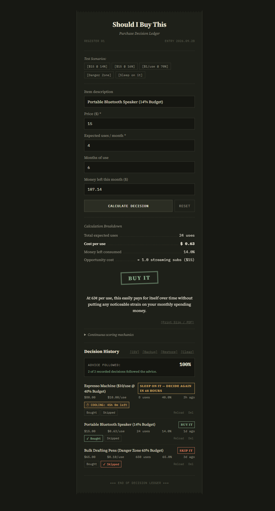

# Should I Buy This — Purchase Decision Ledger

<p align="center">
  
</p>

<p align="center">
  <strong>A continuous-scoring purchase decision calculator styled as an authentic dark paper ledger receipt.</strong>
  <br />
  Eliminates arbitrary cliff-edge cutoffs by balancing cost per use against monthly budget share using smooth linear ramps.
</p>

<p align="center">
  <a href="#-how-the-scoring-model-works">How It Works</a> •
  <a href="#-key-features">Key Features</a> •
  <a href="#-quickstart">Quickstart</a> •
  <a href="#-one-click-deployment">Deploy</a> •
  <a href="#-privacy--data-storage">Privacy</a>
</p>

<p align="center">
  
  
  
  
</p>

---

## 💡 The Problem with Traditional Purchase Checklists

Most personal finance rules use **rigid, arbitrary cutoffs** that create absurd edge cases:
- An item costing **$4.99** is treated as completely harmless, while an item costing **$5.01** triggers an alert.
- Budget percentage checklists ignore whether an item will be used **once** or **every single day for 5 years**.

**Should I Buy This** replaces brittle if/else cutoffs with **smooth, continuous mathematical curves** and a strict **danger-zone affordability floor**.

---

## 🧮 How the Scoring Model Works

### 1. Inputs
- **Item description** (*optional*): Title recorded onto the history tape.
- **Price ($)** (*required*): Total purchase price in dollars ($).
- **Expected uses / month** (*required*): Anticipated usage frequency (e.g. `4` or `2.5`).
- **Months of use** (*optional*): Defaults to `12` months if left blank.
- **Money left this month ($)** (*optional*): Funds remaining after essentials & savings. If left blank, affordability is scored with neutral caution (`5/10`) rather than assumed safe.

### 2. Derived Calculations
$$\text{totalUses} = \max(\text{usesPerMonth} \times \text{months}, 1)$$
$$\text{costPerUse} = \frac{\text{price}}{\text{totalUses}}$$
$$\text{budgetShare} = \left(\frac{\text{price}}{\text{budget}}\right) \times 100 \quad (\text{if budget entered})$$

### 3. Continuous Mathematical Ramps
- **Value Score (0–10)**:
  - $\text{costPerUse} \le \$0.50 \implies 10$
  - $\$0.50 < \text{costPerUse} \le \$20.00 \implies 10 - \left(\frac{\text{costPerUse} - 0.5}{19.5}\right) \times 8$
  - $\$20.00 < \text{costPerUse} \le \$50.00 \implies 2 - \left(\frac{\text{costPerUse} - 20}{30}\right) \times 2$
  - $\text{costPerUse} > \$50.00 \implies 0$

- **Affordability Score (0–10)**:
  - Budget omitted $\implies 5$ (neutral unknown caution)
  - $\text{budgetShare} \le 5\% \implies 10$
  - $5\% < \text{budgetShare} \le 75\% \implies 10 - \left(\frac{\text{budgetShare} - 5}{70}\right) \times 10$
  - $\text{budgetShare} > 75\% \implies 0$

- **Score Weights**:
  $$\text{combined} = (\text{valueScore} \times 0.55) + (\text{affordabilityScore} \times 0.45)$$

- **Danger Zone Hard Floor**:
  If a budget is provided and $\text{budgetShare} > 60\%$, the combined score is strictly capped at $\le 3.0$ (**Skip it**), regardless of how cheap the cost per use is.

### 4. Verdicts
- $\text{Score} \ge 7.0 \implies$ **BUY IT** *(Sage green inked stamp)*
- $4.0 \le \text{Score} < 7.0 \implies$ **SLEEP ON IT — DECIDE AGAIN IN 48 HOURS** *(Accent gold inked stamp)*
- $\text{Score} < 4.0 \implies$ **SKIP IT** *(Soft rust inked stamp)*

---

## ✨ Key Features

- **🧾 Physical Paper Ledger Aesthetic**: Styled as an authentic paper receipt with serrated torn edges, dotted leader lines, and typography paired with *Source Serif 4* and *IBM Plex Mono*. Zero generic SaaS card-kit tropes.
- **🎬 Orchestrated Reveal Sequence**:
  1. Mechanical paper spool advance (`spoolFeed`).
  2. Four metric lines slide in staggered by ~140ms (*Total Uses* $\to$ *Cost per use* $\to$ *Budget share* $\to$ *Opportunity cost*).
  3. Brief ~0.5s pause for numbers to register.
  4. Rubber stamp slams down with overshoot bounce and `-2deg` rotation.
  5. Plain conversational reasoning narrative fades in below (no math jargon).
- **☕ Opportunity Cost Equivalency**: Contextual real-world translations (e.g. `≈ 1.0 streaming subs ($15)` or `≈ 3.0 takeout meals ($25)`).
- **⏳ 48-Hour Cooling Timer**: Decisions marked *"Sleep on it"* display an active countdown timer on the history tape (`⏱ COOLING: Xh Ym left`), automatically switching to `⏱ 48H COOLED: Ready to decide` once 48 hours pass.
- **✂️ Paper Tear-Off Delete**: Deleting a record shears and slides the paper row horizontally off the tape before removal.
- **📳 Mobile Haptic Feedback**: Tactile vibration pulse (`[15, 30, 20]`) upon rubber stamp impact on supported devices.
- **📦 Data Portability**: Export your decision tape to **[CSV]** spreadsheets, download full **[Backup]** JSON files, or **[Restore]** past backups with automatic deduplication.
- **🖨️ Printer & PDF Ready**: Dedicated `@media print` styling outputs a crisp, black-and-white physical receipt on paper or PDF.

---

## 🔒 Privacy & Data Storage

- **100% Client-Side & Private**: All decision history is stored strictly in your browser's **`localStorage`**.
- **Zero Tracking**: No user accounts, cookies, analytics, external APIs, or background servers.
- **Export Anytime**: Your financial records belong to you — backup or export with one click.

---

## ⚡ Quickstart

### Open in Browser
Clone the repository and open `index.html` in any modern web browser:
```bash
git clone https://github.com/<your-username>/should-i-buy-this.git
cd should-i-buy-this
# Open index.html directly, or run:
npx serve .
```

### Run Automated Tests
```bash
# Verify continuous scoring mathematical model and boundaries:
node test.js

# Run full end-to-end headless browser test suite:
node test_new_features.js
```

---

## 🚀 One-Click Deployment

Because this project is built with vanilla web standards and has **zero build steps**, it deploys instantly to any static hosting provider for free:

### Cloudflare Pages *(Recommended)*
1. In [Cloudflare Dashboard](https://dash.cloudflare.com/) $\to$ **Workers & Pages** $\to$ **Create application** $\to$ **Pages**.
2. Connect your repository or drag-and-drop the project folder.
3. Build command: None (leave blank). Output directory: `/` (root).
4. Click **Deploy**.

### GitHub Pages
1. Go to your repository **Settings** $\to$ **Pages**.
2. Under **Build and deployment**, select Source: **Deploy from a branch** $\to$ `main` branch $\to$ `/ (root)` folder.
3. Click **Save**.

### Vercel
Run with the Vercel CLI (uses included `vercel.json` with security headers):
```bash
npx vercel
```

---

## 📄 License

MIT License — feel free to modify, fork, or use for personal or commercial projects.
